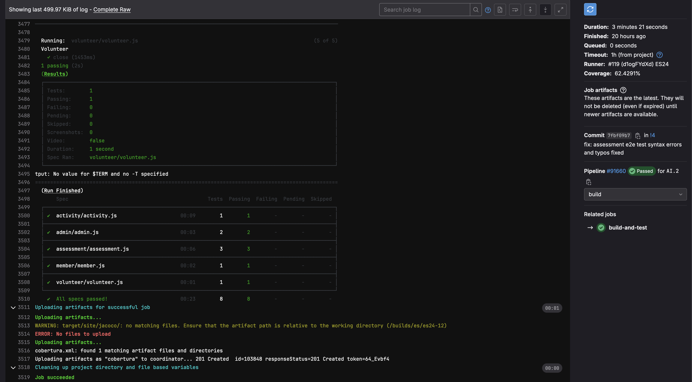

# ES P2 submission, Group 12

## Did your group use the base code provided?

Yes

## Feature CA

### Subgroup
 - Pedro Luís Rodrigues de Almeida, ist1111383, [GitLab link](https://gitlab.rnl.tecnico.ulisboa.pt/ist1111383)
   + Issues assigned: [#58](https://gitlab.rnl.tecnico.ulisboa.pt/es/es24-12/-/issues/58),
                      [#59](https://gitlab.rnl.tecnico.ulisboa.pt/es/es24-12/-/issues/59),
                      [#60](https://gitlab.rnl.tecnico.ulisboa.pt/es/es24-12/-/issues/60),
                      [#61](https://gitlab.rnl.tecnico.ulisboa.pt/es/es24-12/-/issues/61),
                      [#69](https://gitlab.rnl.tecnico.ulisboa.pt/es/es24-12/-/issues/69),
                      [#70](https://gitlab.rnl.tecnico.ulisboa.pt/es/es24-12/-/issues/70),
                      [#71](https://gitlab.rnl.tecnico.ulisboa.pt/es/es24-12/-/issues/71),
                      [#75](https://gitlab.rnl.tecnico.ulisboa.pt/es/es24-12/-/issues/75),

 - João Pedro Correia e Sousa, ist199991, [GitLab link](https://gitlab.rnl.tecnico.ulisboa.pt/ist199991)
   + Issues assigned: [#58](https://gitlab.rnl.tecnico.ulisboa.pt/es/es24-12/-/issues/58),
                      [#59](https://gitlab.rnl.tecnico.ulisboa.pt/es/es24-12/-/issues/59),
                      [#62](https://gitlab.rnl.tecnico.ulisboa.pt/es/es24-12/-/issues/62),
                      [#63](https://gitlab.rnl.tecnico.ulisboa.pt/es/es24-12/-/issues/63),
                      [#64](https://gitlab.rnl.tecnico.ulisboa.pt/es/es24-12/-/issues/64),
                      [#74](https://gitlab.rnl.tecnico.ulisboa.pt/es/es24-12/-/issues/74),
                      [#76](https://gitlab.rnl.tecnico.ulisboa.pt/es/es24-12/-/issues/76),
 
### Merge requests associated with this feature

The list of pull requests associated with this feature is:

 - [MR #5](https://gitlab.rnl.tecnico.ulisboa.pt/es/es24-12/-/merge_requests/5)
 - [MR #6](https://gitlab.rnl.tecnico.ulisboa.pt/es/es24-12/-/merge_requests/6)

### Notes

---

## Feature SP

### Subgroup
 - Ricardo Miguel Guilherme Espadinha, ist1100070, [GitLab link](https://gitlab.rnl.tecnico.ulisboa.pt/ist1100070)
   + Issues assigned: 
   + [#72](https://github.chttps://gitlab.rnl.tecnico.ulisboa.pt/es/es24-12/-/issues/72),
   + [#73](https://github.chttps://gitlab.rnl.tecnico.ulisboa.pt/es/es24-12/-/issues/73),
   + [#77](https://github.chttps://gitlab.rnl.tecnico.ulisboa.pt/es/es24-12/-/issues/77),
   + [#65](https://github.chttps://gitlab.rnl.tecnico.ulisboa.pt/es/es24-12/-/issues/65),
   + [#97](https://github.chttps://gitlab.rnl.tecnico.ulisboa.pt/es/es24-12/-/issues/97),
   + [#99](https://github.chttps://gitlab.rnl.tecnico.ulisboa.pt/es/es24-12/-/issues/99),
   + [#102](https://github.chttps://gitlab.rnl.tecnico.ulisboa.pt/es/es24-12/-/issues/102),
   + [#103](https://github.chttps://gitlab.rnl.tecnico.ulisboa.pt/es/es24-12/-/issues/103),
   + [#104](https://github.chttps://gitlab.rnl.tecnico.ulisboa.pt/es/es24-12/-/issues/104),
   + [#105](https://github.chttps://gitlab.rnl.tecnico.ulisboa.pt/es/es24-12/-/issues/105),

 - Guilherme Macedo Tavares Maia, ist196223, [GitLab link](https://gitlab.rnl.tecnico.ulisboa.pt/ist196223)
   + Issues assigned: 
   + [#66](https://github.chttps://gitlab.rnl.tecnico.ulisboa.pt/es/es24-12/-/issues/66), 
   + [#67](https://github.chttps://gitlab.rnl.tecnico.ulisboa.pt/es/es24-12/-/issues/67),
   + [#68](https://github.chttps://gitlab.rnl.tecnico.ulisboa.pt/es/es24-12/-/issues/68),
   + [#98](https://github.chttps://gitlab.rnl.tecnico.ulisboa.pt/es/es24-12/-/issues/98),
   + [#100](https://github.chttps://gitlab.rnl.tecnico.ulisboa.pt/es/es24-12/-/issues/100)
 
### Merge requests associated with this feature

The list of pull requests associated with this feature is:

 - [MR #7](https://gitlab.rnl.tecnico.ulisboa.pt/es/es24-12/-/merge_requests/7)

### Notes

Dialog is not fully functional.

---

## Feature AI

### Subgroup
- Sebastião Rebelo Da silva Andrade e Sousa, ist190634, [GitLab link](https://gitlab.rnl.tecnico.ulisboa.pt/ist190634)
    + Issues assigned: [#78](https://gitlab.rnl.tecnico.ulisboa.pt/es/es24-12/-/issues/78),
      [#79](https://gitlab.rnl.tecnico.ulisboa.pt/es/es24-12/-/issues/79),
      [#81](https://gitlab.rnl.tecnico.ulisboa.pt/es/es24-12/-/issues/81), 
      [#82](https://gitlab.rnl.tecnico.ulisboa.pt/es/es24-12/-/issues/82),
      [#90](https://gitlab.rnl.tecnico.ulisboa.pt/es/es24-12/-/issues/90),
      [#91](https://gitlab.rnl.tecnico.ulisboa.pt/es/es24-12/-/issues/91),
      [#92](https://gitlab.rnl.tecnico.ulisboa.pt/es/es24-12/-/issues/92),
      [#93](https://gitlab.rnl.tecnico.ulisboa.pt/es/es24-12/-/issues/93),
      [#94](https://gitlab.rnl.tecnico.ulisboa.pt/es/es24-12/-/issues/94),
      [#95](https://gitlab.rnl.tecnico.ulisboa.pt/es/es24-12/-/issues/95),
      [#96](https://gitlab.rnl.tecnico.ulisboa.pt/es/es24-12/-/issues/96)

- Rodrigo Fitas Dias, ist199552, [GitLab link](https://gitlab.rnl.tecnico.ulisboa.pt/ist199552)
    + Issues assigned: [#78](https://gitlab.rnl.tecnico.ulisboa.pt/es/es24-12/-/issues/78),
      [#80](https://gitlab.rnl.tecnico.ulisboa.pt/es/es24-12/-/issues/80),
      [#83](https://gitlab.rnl.tecnico.ulisboa.pt/es/es24-12/-/issues/81),
      [#84](https://gitlab.rnl.tecnico.ulisboa.pt/es/es24-12/-/issues/82),
      [#85](https://gitlab.rnl.tecnico.ulisboa.pt/es/es24-12/-/issues/90),
      [#86](https://gitlab.rnl.tecnico.ulisboa.pt/es/es24-12/-/issues/91),
      [#87](https://gitlab.rnl.tecnico.ulisboa.pt/es/es24-12/-/issues/92),
      [#88](https://gitlab.rnl.tecnico.ulisboa.pt/es/es24-12/-/issues/93),
      [#89](https://gitlab.rnl.tecnico.ulisboa.pt/es/es24-12/-/issues/94)

### Merge requests associated with this feature

The list of pull requests associated with this feature is:

- [MR #4](https://gitlab.rnl.tecnico.ulisboa.pt/es/es24-12/-/merge_requests/4)

### Test Coverage Screenshot

The screenshot includes the test coverage results associated with the new/changed entities:

---